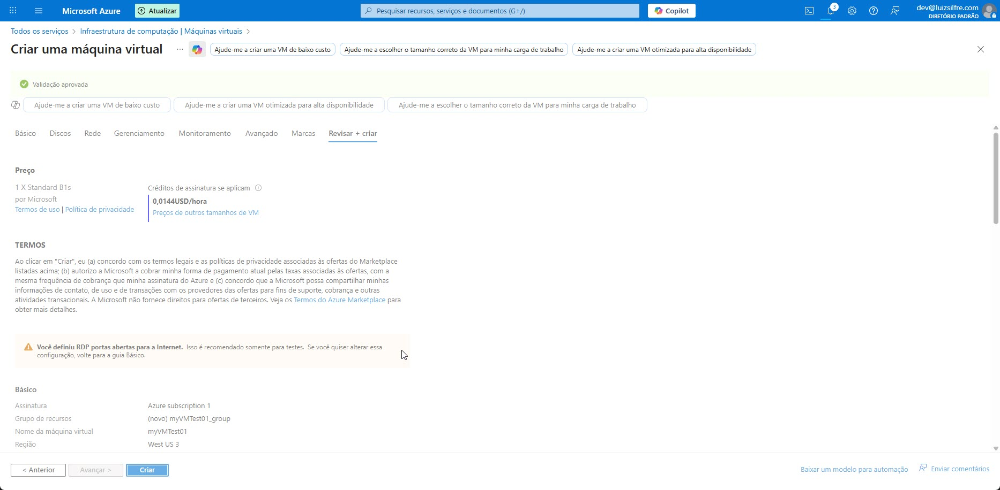
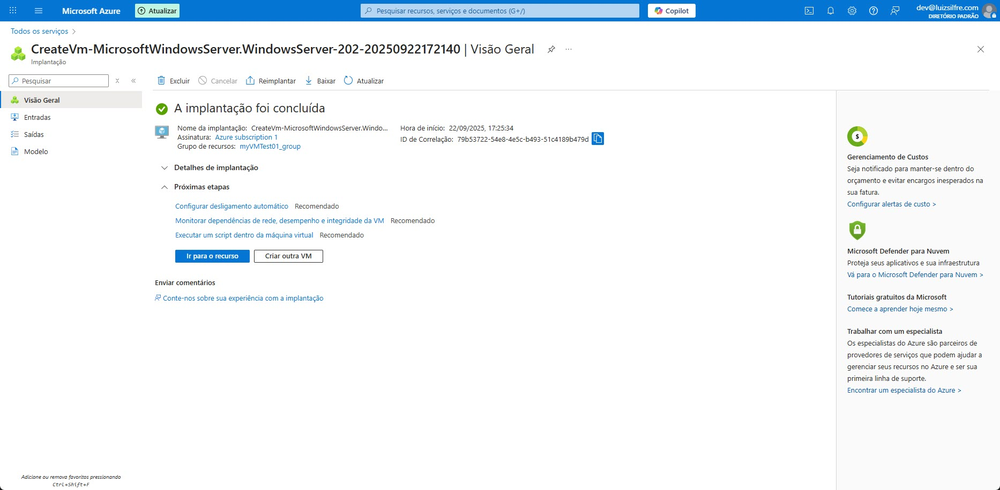
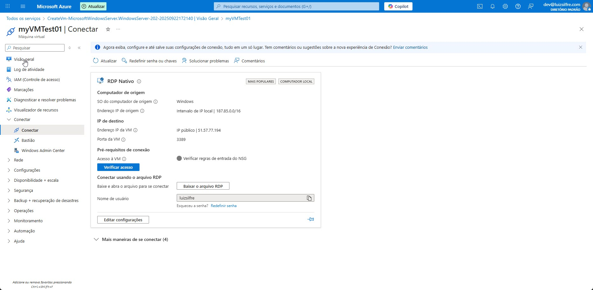
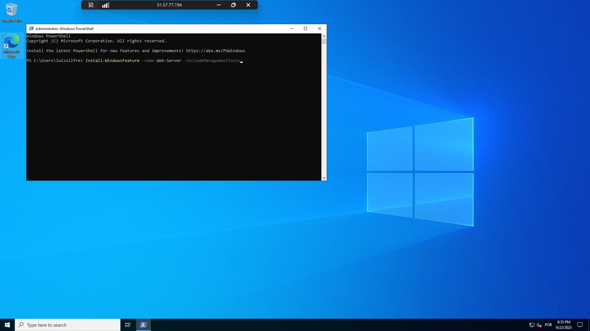

# O que aprendi no curso Benefícios da Nuvem
No curso **“Benefícios da Nuvem”**, aprendi como a adoção da computação em nuvem pode transformar projetos e organizações, trazendo vantagens estratégicas e operacionais. Entre os principais pontos estudados estão:

- ☁️ **Alta Disponibilidade**: garantir que serviços permaneçam ativos mesmo diante de falhas ou interrupções.
- 📈 **Escalabilidade e Elasticidade**: ajustar recursos de forma vertical ou horizontal, acompanhando a demanda sem comprometer a continuidade.
- 🔄 **Confiabilidade**: infraestrutura descentralizada que torna os sistemas mais resilientes.
- 📊 **Previsibilidade**: maior controle de custos e desempenho.
- 🔒 **Segurança**: recursos avançados já disponíveis no ambiente de nuvem, com responsabilidade compartilhada entre provedor e cliente.
- 🛠 **Governança e Gerenciabilidade**: ferramentas para conformidade, auditoria e administração simplificada via portal, scripts e APIs.

Além da teoria, realizei uma prática no **Microsoft Azure**, criando e acessando uma máquina virtual, o que consolidou ainda mais a experiência e mostrou a aplicabilidade dos conceitos.

---
## Algumas imagens da experi~encia de criar uma VM:

